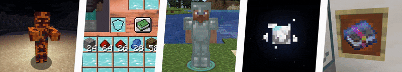

# MoreMcmeta


Animate almost any texture with more options.

This means:
* more possibilities for resource packs
* [a familiar animation format](https://github.com/soir20/MoreMcmeta/wiki/User-Docs:-Animation-Format)
* not invasive—better compatibility with other mods



## Are You in the Right Place?
If you're here to make a suggestion or bug report, find out how MoreMcmeta works, or contribute to its development, you're in the right place!

If you're looking to download MoreMcmeta or find out more about it, check out the [CurseForge page](https://www.curseforge.com/minecraft/mc-mods/moremcmeta).

## For All Contributors
The [Contributing Guide](CONTRIBUTING.md) explains how to submit a suggestion, file a bug report, or create a pull request. That page includes all types of contributors, not just developers, and may be a helpful starting point.

The [Code of Conduct](CODE_OF_CONDUCT.md) describes acceptable vs. inappropriate behavior in this repository. In short, use common sense.

## For Developers
### Clone
**URL**

```
https://github.com/soir20/MoreMcmeta.git
```

**SSH**

```
git@github.com:soir20/MoreMcmeta.git
```

**GitHub CLI**

```
gh repo clone soir20/MoreMcmeta
```

**Fork**

Use the "Fork" button at the top right of this page.

### Build
MoreMcmeta uses Gradle and the [Architectury Plugin](https://github.com/architectury/architectury-plugin) for cross-mod loader builds. However, it does not use the Architectury API. There simply isn't enough boilerplate code that MoreMcmeta needs to justify another dependency. JUnit is the unit testing framework.

There's a lot of build tasks, but the important ones are the `build` and `test` tasks under `common` (cross-loader), `forge`, and `fabric`. These correspond to MoreMcmeta's three source directories/Gradle subprojects.

* The `build` task generates a finished mod in `fabric/build/libs` or `forge/build/libs`.
* The `test` task runs unit tests for the given directory. The best way to view code coverage is to run the task for all subprojects and add the results together.

If you've set up a modded Minecraft environment before, MoreMcmeta is not much different. Gradle will do most of the work after you import the project.

### Run
After you import the Gradle project, the Architectury plugin should automatically generate run configurations for the client and server on Forge and Fabric. MoreMcmeta is a client-sided mod, but the server tasks are important to verify that it does not crash a dedicated server.

### Release
View built releases at the [Releases](https://github.com/soir20/MoreMcmeta/releases}) page. Generally, this page has exactly the same versions as CurseForge. Stable development builds may be there in the future.